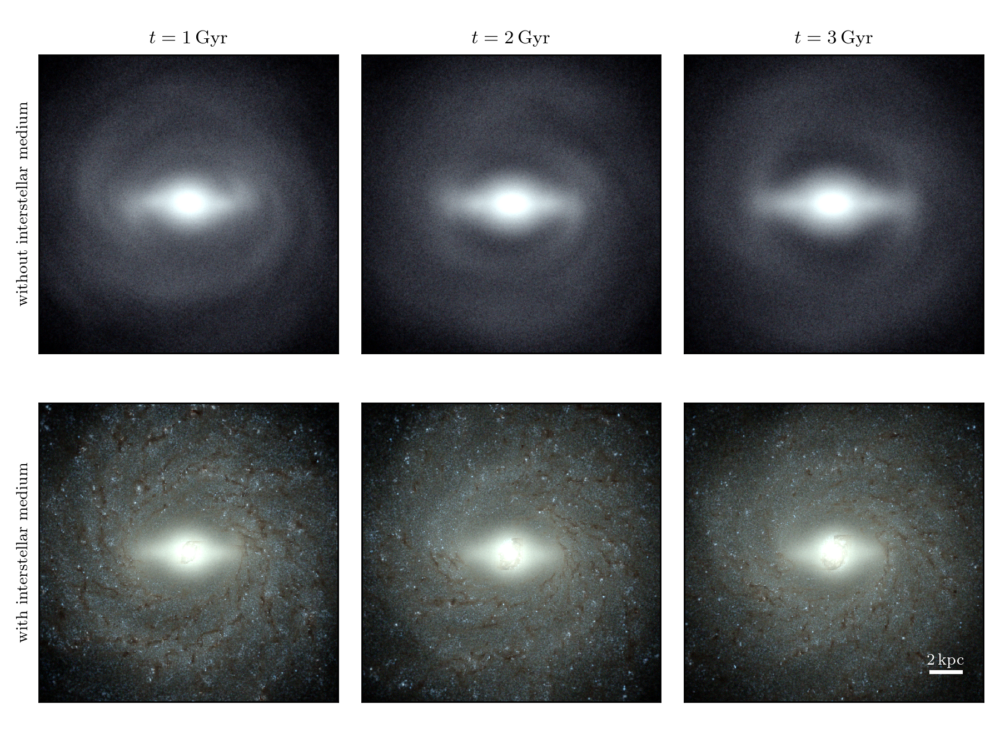

# Stellar Bars in Isolated Gas-Rich Spiral Galaxies Do Not Slow Down

### Angus Beane, Lars Hernquist, Elena D’Onghia, Federico Marinacci, Charlie Conroy, Jia Qi, Laura V. Sales, Paul Torrey, and Mark Vogelsberger

This GitHub repository contains associated data and scripts used in the above submitted paper.

## File Layout
* `paper/` contains the LaTeX source files as well as frozen figures for the paper
* `plots/` contains the scripts used to make the figures in the paper, as well as the data behind the figures
* `analysis/` contains the main analysis scripts (does not include most of the simulation data)
* `movies/` contains scripts for making movies

## Abstract

Elongated bar-like features are ubiquitous in galaxies, occurring at the centers of approximately two-thirds of spiral disks. Due to gravitational interactions between the bar and the other components of galaxies, it is expected that angular momentum and matter will redistribute over long (Gyr) timescales in barred galaxies. Previous work ignoring the gas phase of galaxies has conclusively demonstrated that bars should slow their rotation over time due to their interaction with dark matter halos. We have performed a simulation of a Milky Way-like galactic disk hosting a strong bar which includes a state-of-the-art model of the interstellar medium and a live dark matter halo. In this simulation the bar pattern does not slow down over time, and instead remains at a stable, constant rate of rotation. This behavior has been observed in previous simulations using more simplified models for the interstellar gas but it has remained unexplained. We propose that the gas phase of the disk and the dark matter halo act in concert to stabilize the bar pattern speed and prevent a bar from slowing down or speeding up. We find that in a Milky Way-like disk, a gas fraction of only about 5% is necessary for this mechanism to operate. This result naturally explains why nearly all observed bars rotate rapidly and is especially relevant for our understanding of how the Milky Way arrived at its present state.
